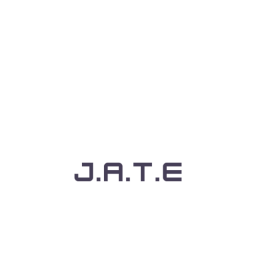
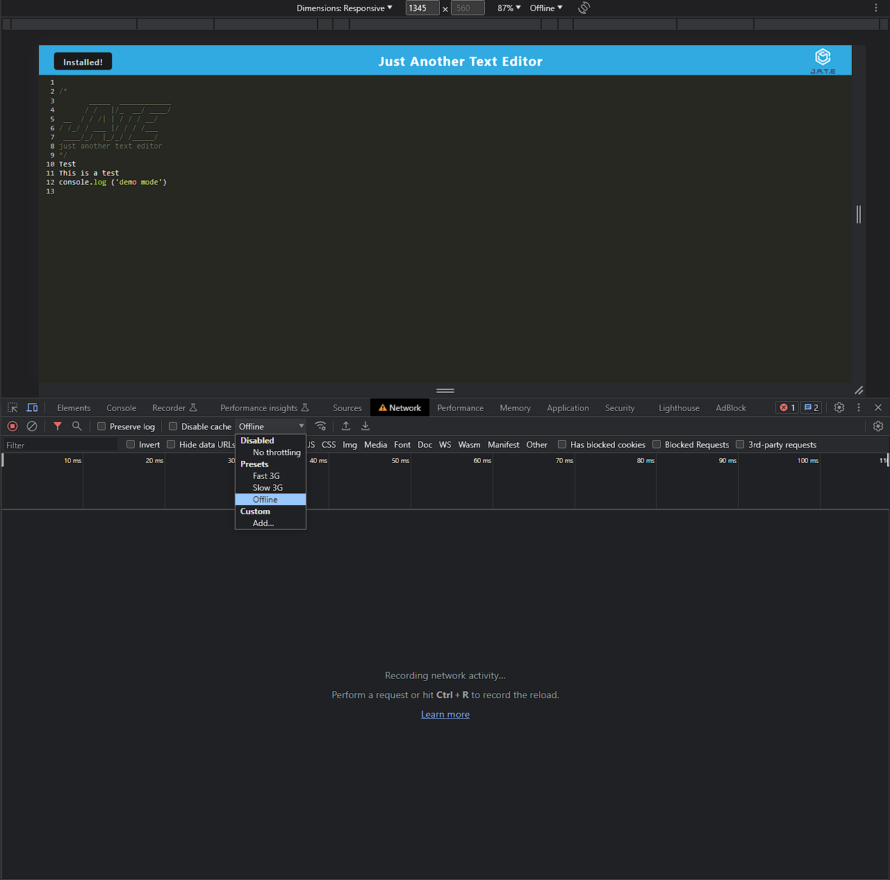

# Text-Editor-Ink👩🏻‍💻


[](https://opensource.org/licenses/MIT) 

## Table of Contents📜

- [Description](#description)

- [Screenshots](#screenshots)

- [Live-URL](#live-url)

- [Technologies-Used](#technologies-used)

- [Installation](#installation)

- [Credits](#credits)

- [Usage-Information](#usage-information)

- [Suggested-Future-Development](#suggested-future-development)

- [Contribution-Guidelines](#contribution-guidelines)

- [Test-Instructions](#test-instructions)

- [License](#license)

- [Questions](#questions)

## Description   
📝
J.A.T.E is a Progressive Web Application (PWA) that runs in the browser, offline and can be installed locally to your machine.This application was built for the purpose of demonstrating and honing skills of progressive web application.J.A.T.E uses an IndexedDB database and the idb package. This application is deployed to Heroku, to access it in production continue reading the documentation!


## Screenshots
📸




## Live URL
📼


[Link To App](https://sleepy-woodland-63665-2eac0020f587.herokuapp.com/)


## Technologies Used
✅


## Installation
💾

To run J.A.T.E locally:

1. Pull down and/or branch this repository
2. Run ```npm i``` to install all dependencies
3. Invoke application with ```npm run start```
4. Go to the port on your local host.
5. Click the "Install" button.

Alternatively, to use the live application, click on The link to the Heroku app above.

## Credits

This application code followed The # 19 Model project from bootcamp.

## Usage Information


## Contribution Guidelines
👥

if you choose to do so open an issue and modify any changes you would like to see on a feature branch and wait for approval before merging to the main branch. Thank you.

## Test Instructions

N/A

## License

NOTICE: This application is covered under the MIT License

## Questions 
💬
Have additional questions? Click the links below to reach me through my GitHub account or Email address.


[Link to Github](https://github.com/RichMur84/Text-Editor-Ink)


<a href="mailto:grizzlylbc1@gmail.com">grizzlylbc1@gmail.com</a>
